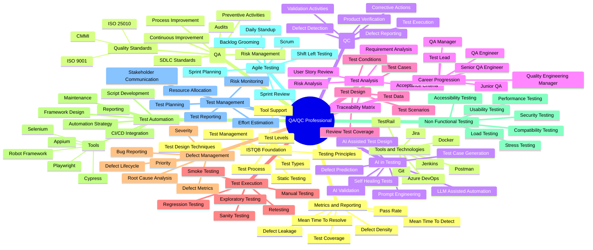

# ISTQB QA/QC Role Mind Map

### AI-Generated Mistakes Identified

1. **Poor Visual Hierarchy and Clutter:** The mindmap lacks clear groupings and logical flow. Branches are not well-organized according to standard ISTQB phases, making the diagram cluttered and difficult to comprehend.
2. **Duplicate Branches:** The "Test Management" branch appears twice—once as a sub-branch under "ISTQB Foundation" and again as a completely separate top-level branch with different child nodes.
3. **Inconsistent Naming Conventions:** The mindmap switches naming styles mid-map. While most branches use noun phrases (e.g., "Test Management", "Defect Management"), others use prepositional phrases ("AI in Testing"), conjunctive phrases ("Tools and Technologies"), or lack proper hyphenation ("Non Functional Testing" instead of "Non-Functional").
4. **Scattered Tool Categorization:** Tools are incoherently split across the map. "Jira", "Postman", and "Git" are listed under a general "Tools and Technologies" branch, while "Selenium", "Playwright", and "Cypress" are buried under a "Tools" sub-branch within "Test Automation". There is no overarching taxonomy to explain this separation.