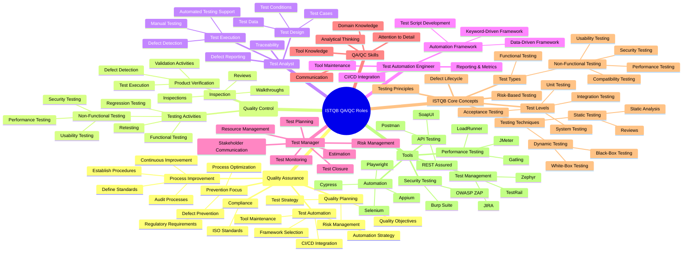

# ISTQB QA/QC Role Mind Map

```mermaid
mindmap
  root((ISTQB QA/QC Roles))

    QA (Quality Assurance)
      Process Improvement
        Define Standards
        Establish Procedures
        Audit Processes
        Continuous Improvement
      Quality Planning
        Test Strategy
        Quality Objectives
        Risk Management
      Prevention Focus
        Defect Prevention
        Process Optimization
      Compliance
        ISO Standards
        Regulatory Requirements
      Test Automation
        Automation Strategy
        Framework Selection
        CI/CD Integration
        Tool Maintenance

    QC (Quality Control)
      Product Verification
        Test Execution
        Defect Detection
        Validation Activities
      Inspection
        Reviews
        Walkthroughs
        Inspections
      Testing Activities
        Functional Testing
        Non-Functional Testing
          Performance Testing
          Security Testing
          Usability Testing
        Regression Testing
        Retesting

    Test Analyst
      Test Design
        Test Cases
        Test Data
        Test Conditions
      Test Execution
        Manual Testing
        Automated Testing Support
        Defect Detection
      Defect Reporting
      Traceability

    Test Automation Engineer
      Automation Framework
        Test Script Development
        Keyword-Driven Framework
        Data-Driven Framework
      CI/CD Integration
      Tool Maintenance
      Reporting & Metrics

    Test Manager
      Test Planning
      Resource Management
      Estimation
      Risk Management
      Stakeholder Communication
      Test Monitoring
      Test Closure

    QA/QC Skills
      Analytical Thinking
      Communication
      Attention to Detail
      Domain Knowledge
      Tool Knowledge

    ISTQB Core Concepts
      Testing Principles
      Test Levels
        Unit Testing
        Integration Testing
        System Testing
        Acceptance Testing
      Test Types
        Functional Testing
        Non-Functional Testing
          Performance Testing
          Security Testing
          Usability Testing
          Compatibility Testing
      Testing Techniques
        Static Testing
          Reviews
          Static Analysis
        Dynamic Testing
          Black-Box Testing
          White-Box Testing
      Defect Lifecycle
      Risk-Based Testing

    Tools
      Test Management
        JIRA
        TestRail
        Zephyr
      Automation
        Selenium
        Cypress
        Playwright
        Appium
      API Testing
        Postman
        REST Assured
        SoapUI
      Performance Testing
        JMeter
        LoadRunner
        Gatling
      Security Testing
        Burp Suite
        OWASP ZAP
```

---
